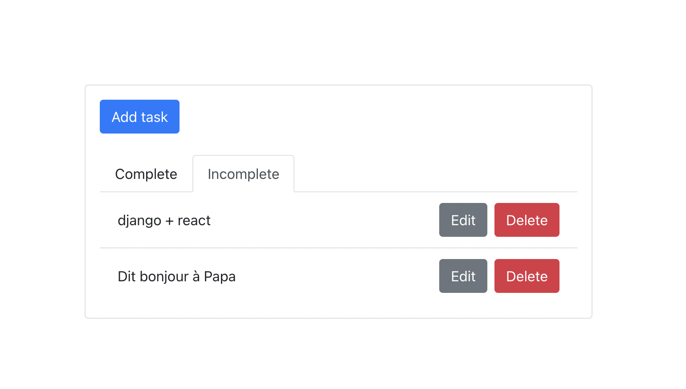

# django react todo app

## Overview

Follow 

https://www.digitalocean.com/community/tutorials/build-a-to-do-application-using-django-and-react

<div align="center">


</div>

<div align="center">


</div>


## Setup for a clean Python environment

You can either use the Makefile 

```bash
make venv
make install
make lint
make clean
```

(Note that ``make clean`` removes the virtual environment.)

or do the following:

To set up a virtual environment and install dependencies, run the following commands:

1. Create a virtual environment

```bash
python3 -m venv ./venv
source ./venv/bin/activate
```

2. Install the dependencies

```bash
pip install --no-cache-dir -r requirements.txt
```

Note: You can delete the unnecessary folders via

```bash
rm -rf 
```

## Getting ready to use the application

Start backend server

```sh
python manage.py runserver
```

Start react

```sh
npm start
```
